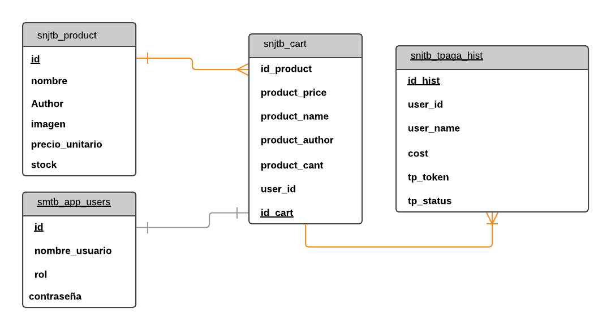

# Comercio_REST
Servidor Modelo Control

### Descricion

En este servidor se podran encontrar todos los fuentes asociados a servicios REST y a conexion con la base de datos MySQL, se busca dar detallada explicacion de cada carpeta.

#### persistence

En esta carpeta se encuentra configurados el acceso a la BD

Modelo BD

De igual manera se encuentran las peticiones de base de datos por cada tipo de transaccion, libros (books.js), carrito (cart.js), finalizacion de compra (end_of.js), usuarios (users.js) y conexion con BD (conn.js).

